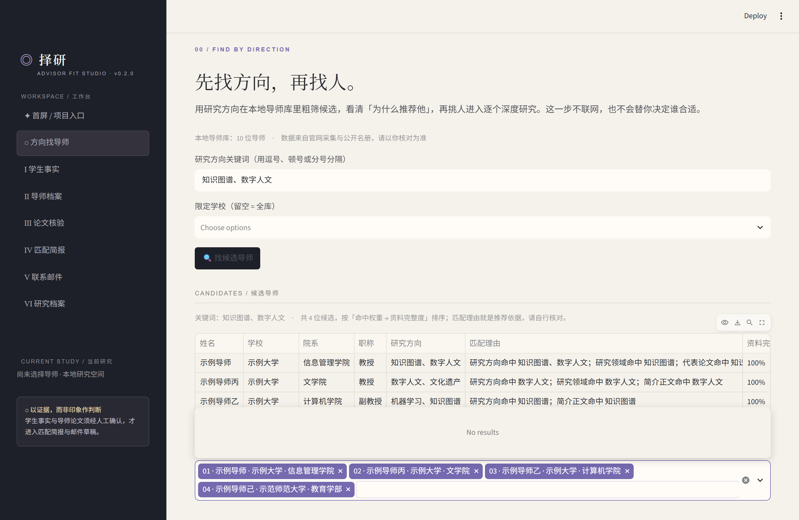
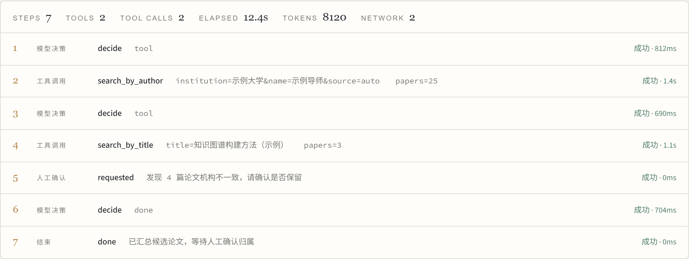
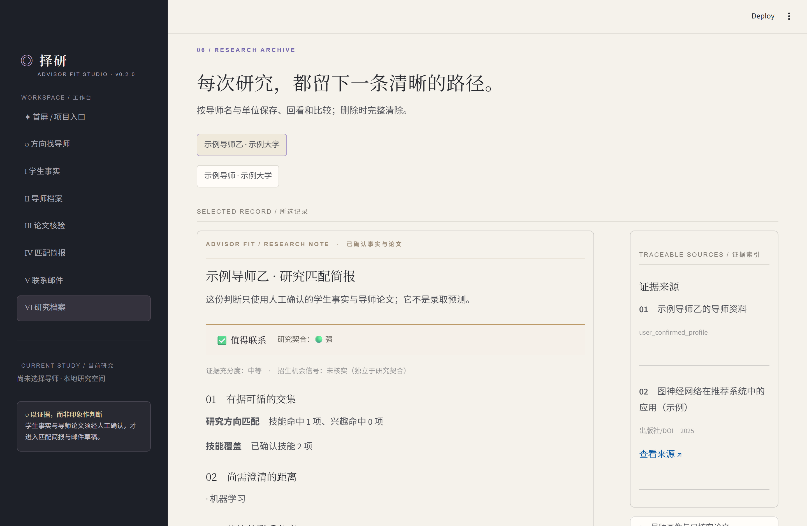
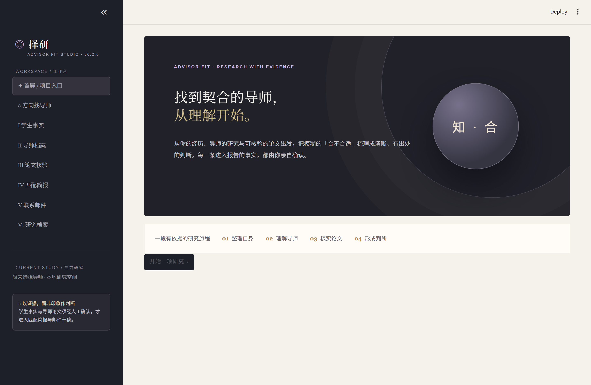
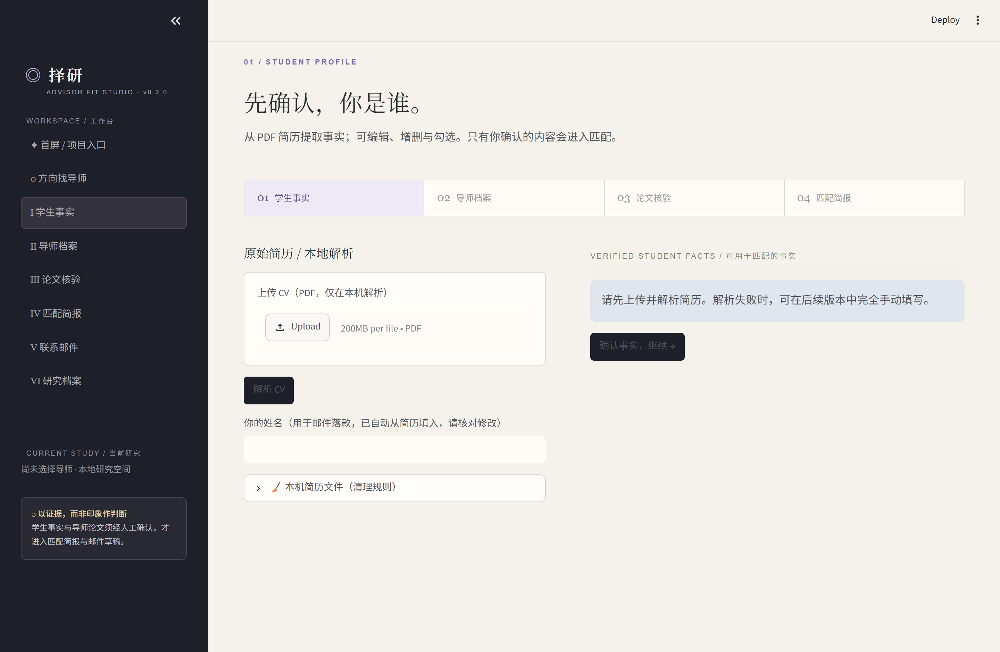
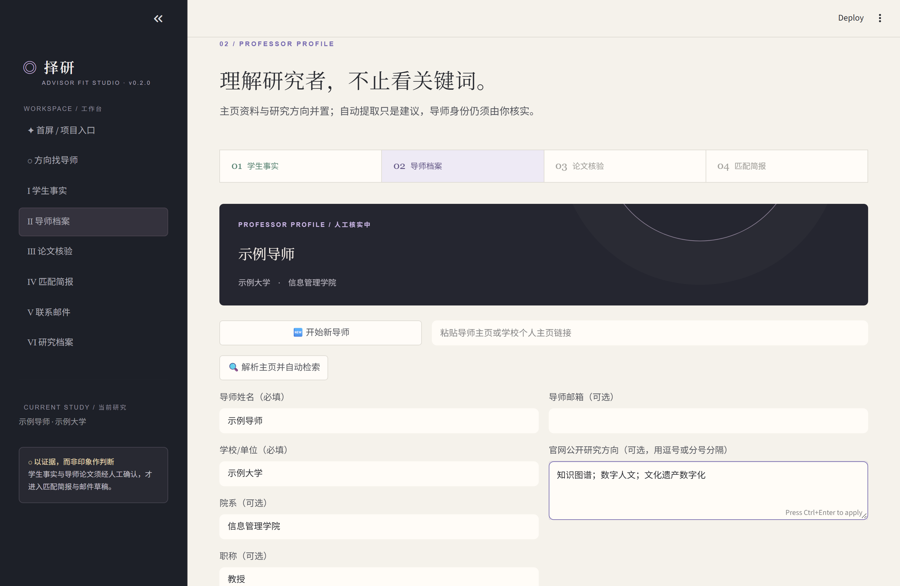
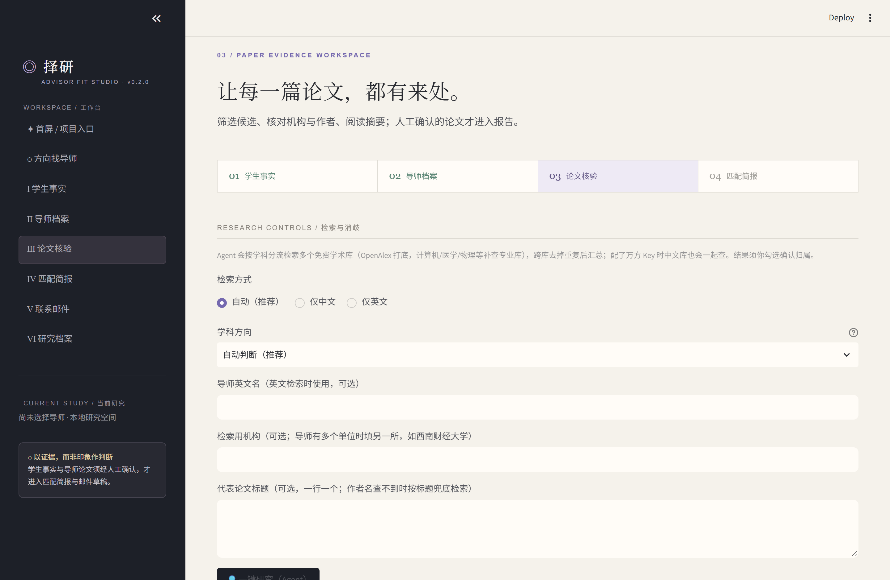
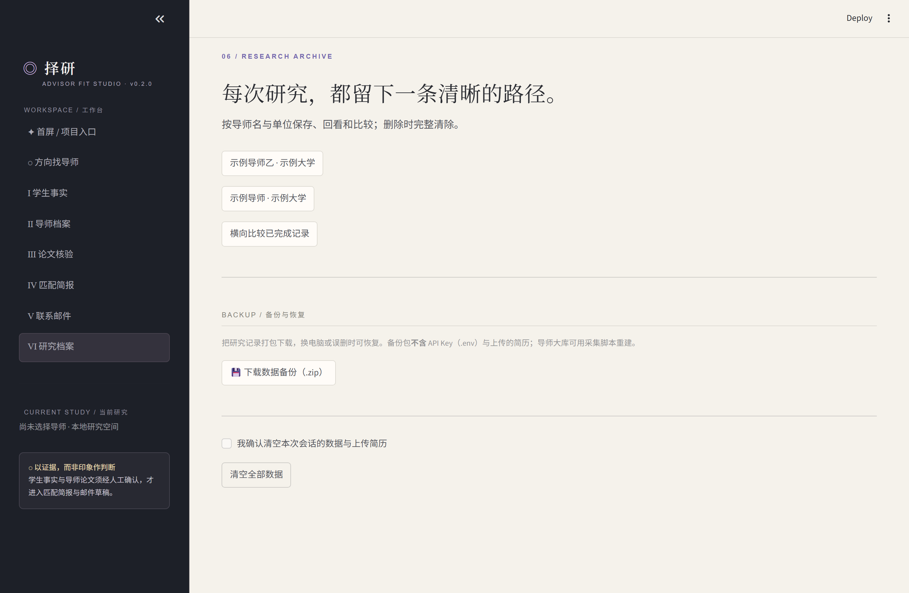

# 择研 · Advisor-Fit AI

**面向国内硕博双选 / 套磁的「导师研究匹配助手」——证据驱动、本地优先、每一步都能点开看来源。**

你给它你的简历和一位导师，它去多个免费学术库把这位导师的论文找出来、逐篇核对是不是本人，
再把「你的经历」和「他的研究」摆在一起，告诉你哪里真的有交集、哪里还差得远，
最后写一封**每句话都有出处**的联系邮件草稿。

- 🔍 **不编造**：所有结论分「已证实 / 推测 / 未知」三态，没有证据就写"未知"
- 🧾 **可追溯**：每条进入报告的结论都能点开看到来源链接和抓取时间
- ✅ **人工门控**：论文归属、学生事实都必须你亲手勾选确认，系统不替你认定
- 🔒 **本地优先**：简历只在你电脑上解析，数据存在本地 SQLite；不需要联网也能跑完整流程
- 🆓 **零 Key 起步**：论文检索默认走免费公开学术库，不用申请任何 Key

<p align="center">
  
</p>

<p align="center"><sub>不知道找谁时，先用研究方向在本地导师库粗筛候选，看清「为什么推荐他」再挑人。</sub></p>

## 这不是一个表单工具，是一个 Agent

底层是一套自研的轻量 **Agent Harness**：模型负责决策（下一步查什么、要不要停下来问人），
Harness 负责管住它（工具契约、预算闸门、运行轨迹、证据接地、失败降级）。

```
LLM 决策 ──► 执行工具 ──► 结果回传 ──► 再决策
   │              │
   │              └─ 失败也回传，让模型自己换招
   └─ 拿不准就暂停，请人确认（不擅自认定）
```

- **4 个正式工具**：按作者检索 / 按标题检索 / 读导师主页 / 核对候选论文机构。
  每个工具都声明了参数 schema、权限、单轮限流、缓存时长、超时与重试；
  装配时校验「声明了必须有实现」，不让模型看到调不通的工具。
- **预算闸门**：步数 / LLM 调用 / token / 外部请求 / 墙钟五维记账，触顶优雅降级而非崩溃。
- **运行轨迹**：调了哪些工具、每步多久、成功还是失败、花了多少 token，页面上直接看，
  也能导出 JSON。

<p align="center">
  
</p>

<p align="center"><sub>一次运行的轨迹：模型决策、工具调用、人工确认门控，以及 token 与外部请求消耗。</sub></p>

架构细节、模块清单、以及**与最终形态还差什么**（诚实记录）见
**[docs/agent-harness.md](docs/agent-harness.md)**。

## 它到底解决什么问题

套磁最花时间的不是写邮件，而是**搞清楚这位导师到底在研究什么**：官网常年不更新、
知网要登录、中文重名一搜一大片。很多人最后只能凭印象写一封"拜读过您的论文"的模板信。

这个工具把这件事拆成可核验的步骤：**先确认你是谁 → 再确认他是谁 → 再确认他写过什么 →
最后才下判断**。中间每一步都留证据、都等你确认，拿不准的地方它会明说"不知道"。

## 30 秒看懂流程

```
① 上传简历（本地解析）   ② 确认你的可用事实      ③ 找导师
   姓名/技能/项目          你勾选，才进入匹配        方向找导师，或直接填姓名+学校
                                                        │
                      ⑥ 邮件草稿  ←  ⑤ 匹配简报  ←  ④ 论文核验
                         每句绑定来源      交集/缺口/证据      多库检索 + 逐篇确认归属
```

<p align="center">
  
</p>

<p align="center"><sub>研究简报：结论、交集、缺口与证据索引并排；不确定的地方如实标注，而不是给个漂亮分数。</sub></p>

## 界面一览

| 页面 | 做什么 |
|---|---|
| **✦ 首屏** | 项目入口与流程说明 |
| **◌ 方向找导师** | 研究方向关键词 → 本地导师库粗筛 → 可解释排序 → 并排比较 → 带入研究 |
| **Ⅰ 学生事实** | 上传 PDF 简历，逐条编辑/增删/勾选；只有你确认的才进入匹配 |
| **Ⅱ 导师档案** | 姓名+学校手动填 / 主页链接自动解析 / 从导师库填充；字段缺了不阻断，标「未知」 |
| **Ⅲ 论文核验** | Agent 按学科分流检索多个学术库，逐篇消歧，分「匹配 / 需审核 / 疑似同名」 |
| **Ⅳ 匹配简报** | 研究交集、能力匹配、背景缺口、建议的联系角度 |
| **Ⅴ 联系邮件** | 每句话绑定"你的某条经历"或"他的某篇论文"，可编辑、可下载，**不会自动发送** |
| **Ⅵ 研究档案** | 历史记录回看与并排比较、数据备份、完整删除 |

<details>
<summary>更多界面截图</summary>

| | |
|---|---|
|  |  |
|  |  |
|  | |

> 截图里的导师、论文、学校**全部是虚构的演示数据**（`src/advisor_fit/demo_data.py` 生成），
> 不涉及任何真实人物。想自己重新生成截图：先按下面「部署在线 Demo」里的方式用演示数据
> 启动应用，再运行 `scripts\shoot_screenshots.py`。

</details>

## 快速开始

**只想先看看长什么样**（自动生成虚构演示数据，不碰你的真实数据）：

```powershell
uv sync
.\.venv\Scripts\python.exe -m streamlit run streamlit_app.py
```

这个入口会在 `data/demo-data/` 里生成一份**全部虚构**的演示数据（10 位导师 + 2 条研究记录），
然后启动应用。演示数据和真实数据完全隔离，删掉 `data/demo-data/` 即可重置。

**正常使用**：

```powershell
uv sync                                  # 安装依赖
.\.venv\Scripts\python.exe -m streamlit run app.py
```

浏览器打开 `http://localhost:8501` 即可。**不需要配置任何 API Key**：
- 论文检索默认走免费公开学术库（OpenAlex / Europe PMC / arXiv / Crossref）；
- 不配大模型 Key 时，简历抽取和邮件生成自动降级为「规则 + 事实锁定模板」，流程照样跑得通。

想效果更好可以选配（都在 `.env` 里，见 `.env.example`）：

| 变量 | 作用 | 必需？ |
|---|---|---|
| `LLM_API_KEY` | 让简历抽取、深度分析和邮件更自然 | 可选 |
| `CONTACT_EMAIL` | 填入后进入 OpenAlex/Crossref 的"礼貌池"，配额更稳 | 可选 |
| `WANFANG_APP_KEY` | 补充**中文文献** | 可选 |
| `AMINER_API_KEY` | AMiner 学者画像（按次计费） | 可选，默认关闭 |

## 部署在线 Demo

想把它挂到网上给别人试（不登录、不存真实数据），仓库里已经备好了配置：

**方式一：Streamlit Community Cloud（免费、最省事）**

1. 把仓库推到 GitHub；
2. 在 [share.streamlit.io](https://share.streamlit.io) 新建应用，入口文件选 **`streamlit_app.py`**；
3. 依赖会自动按 `requirements.txt` 安装。**不要配 `.env`** —— 演示站就该是零 Key、零真实数据的。

**方式二：Docker（自托管）**

```powershell
docker build -t advisor-fit-demo .
docker run --rm -p 8501:8501 advisor-fit-demo
```

两条路跑的都是同一个入口：启动时生成虚构演示数据 → 打开就是完整界面。

> **为什么演示站必须走 `streamlit_app.py`**：它把数据目录指向独立的 `data/demo-data/`，
> 并在首次启动时写入一份带「演示数据」标记的虚构数据。真实数据目录不会被读到，
> 访问者也不可能看到别人的简历。`requirements.txt` 由 `scripts/sync_requirements.py`
> 从 `pyproject.toml` 同步，两边不一致时测试会失败。

## 项目结构：产品与采集工具分开两个文件夹

本仓库只包含**产品主体**（Streamlit 应用）。导师数据的采集与建库工具是配套的独立项目，
放在**同级目录** `../advisor-fit-crawl/`：

```
C:\projects\
├── advisor-fit-ai\        ← 本仓库：产品主体，可独立运行、可推 GitHub
│   ├── app.py  src/  tests/  evals/  seeds/  docs/
│   ├── scripts/           ← 产品自带脚本（自检 / 评测 / 版本检查 / 备份）
│   └── data/              ← 数据库（advisors.db 等），git 忽略
└── advisor-fit-crawl\     ← 采集与建库工具（独立仓库）
    ├── scripts/           ← 11 个爬取脚本
    ├── data/  logs/  reports/  docs/
    └── tests/
```

**为什么要分开**：采集是"把数据做出来"的过程，产品是"用户用的东西"。混在一起会让
git 仓库被采集脚本污染，项目根目录堆满日志和原始抓取结果。

**两边怎么交接**：只通过**数据库**。采集工具把库写进本仓库的 `data/`，产品读它。
数据库和 `.env`（大模型 Key）都只有一份，放在本仓库。产品的数据路径已固定为
**绝对路径**（见 `src/advisor_fit/config.py`），不会因为"从哪个目录启动"而读错库。

采集工具怎么用，见 `../advisor-fit-crawl/README.md`。

## 为什么改为人工证据输入

中国高校导师主页结构差异大，中文姓名在学术数据库中的消歧也不稳定。v0.1 先解决最核心的问题：不依赖官网抓取、OpenAlex 或 LLM API，也能让一个真实案例完整跑通。

## 产品边界

**做**：本地 CV 解析与姓名自动提取、学生事实人工审核、主页解析、**多源学术检索（按学科分流 + 跨库去重）**、作者消歧与机构审核、按方向找候选导师、分维度匹配、LLM 个性化邮件、历史记录命名与对比、Markdown/JSON/Word 导出、数据备份、完整删除。

**暂不做**：知网/Google Scholar 等需登录或明确禁止抓取的站点、Word/Excel 导入、论文 PDF 解析、扫描件 OCR、自动发送或跟进。

> 导师官网的 JS 动态页可以在采集工具里用 Playwright 通道渲染后再解析，但**必须由用户手动触发**，不做批量自动抓取。

## 可选增强与细节

LLM 配置支持多供应商：复制 `.env.example` 为 `.env`，设置 `LLM_PROVIDER`（`deepseek` 默认 / `openai` / `anthropic` / `ollama`）与 `LLM_API_KEY`。`LLM_BASE_URL`、`LLM_MODEL` 留空则用所选供应商的默认地址与模型。

简历解析：默认用 `pypdf` 提取文本；若额外安装了 `docling`（可选增强），会自动用它把 PDF 转成 Markdown，对复杂版式/表格/中文简历效果更好，失败时仍回退到 `pypdf`。重装依赖：

```powershell
uv sync                 # 基础依赖
uv sync --extra pdf     # 额外装上 docling（可选）
```

## 论文检索：多源分流（默认不需要任何 Key）

「③ 导师论文核验」的「🔎 一键研究（Agent）」会**按学科分流**去多个学术库查论文，
再跨库去掉重复后汇总。默认主干全部是**免费、免申请 Key** 的公开学术库，
所以新用户装完就能直接用，不需要先注册账号。

| 学科 | 主查 | 说明 |
|---|---|---|
| 全学科打底 | **OpenAlex** | 约 2.5 亿条文献，自带学科分类与作者机构 |
| 计算机 / AI | DBLP（当前被反爬拦下，默认关闭）、arXiv | 见下方"已知限制" |
| 医学 / 生命科学 | **Europe PMC** | 覆盖 PubMed 记录与预印本，含摘要 |
| 物理 / 数学 | arXiv | 预印本 |
| 中文文献 | 万方（可选） | 需在 `.env` 配置 `WANFANG_APP_KEY` |
| 中文学者画像 | AMiner（可选，默认关闭） | 按次计费，需要申请 Token |

检索流程：

1. **定学科**：你在页面上选 → 没选就按院系/研究方向里的关键词判断 → 再不行就用检索结果里的学科标签反推（至少 3 篇论文支持才采纳）。
2. **找作者档案**：中文名和英文名都拿去 OpenAlex 查作者档案，**机构对得上才认**；对不上就退回"按论文署名检索 + 逐篇核对姓名"，宁可不认也不塞错人的论文给你。
3. **逐个查**：同源限速、计入预算闸门；某个库报错或被反爬拦下只跳过并写明原因，不影响其它库。
4. **跨库合并**：有 DOI 按 DOI 认同一篇；没有就按"标题归一化 + 年份相近"比对；同一篇被多个库收录时字段互补（摘要取最全的），候选里会显示"收录于：OpenAlex、Europe PMC"。

没有配任何 Key、甚至没有 LLM 时，检索依然可用（降级为确定性检索 + 机构规则消歧），
结果一律标「待确认」，必须由你逐条勾选确认归属后才会进入报告。

### 想调整检索源？改配置，不用改代码

`config/sources.json` 是**可选的覆盖文件**（不存在就用内置默认值），用来调整分流规则、
开关某个库、改优先级和限速：

```json
{
  "sources": [
    {"key": "dblp", "enabled": true},
    {"key": "openalex", "rank": 5, "min_interval_seconds": 0.5},
    {"key": "semanticscholar", "label": "Semantic Scholar", "rank": 8}
  ],
  "discipline_keywords": {"cs": ["计算机", "人工智能", "提示工程"]}
}
```

只写想覆盖的字段即可，没写的沿用默认值；写坏了会自动回退到默认配置，不会让检索失败。

> **两种"更新"要分清**：库里**数据**的更新（导师库、网页缓存、论文缓存）不用改代码，
> 重跑采集脚本即可；**接入一个全新网站**才需要写一个小适配器（把对方的返回格式翻译成
> 我们统一的论文结构）+ 在配置表里加一行。

### 已知限制（诚实记录）

- **DBLP 已启用 Anubis 反爬校验**：程序请求会拿到 HTML 挑战页而不是 JSON（实测 dblp.org 与
  dblp.uni-trier.de 都一样），所以默认关闭；计算机领域的召回目前由 OpenAlex 承担。
  DBLP 取消校验后，把 `config/sources.json` 里的 `enabled` 改成 `true` 即可启用。
- **Crossref 只用于按标题补全**：它的"作者查询"实际是模糊全文检索（实测查「张伟」会返回煤矿论文），
  所以不参与按作者检索这一步。
- **常见中文名 + 没有英文名时精度有限**：同名作者档案可能有几十个，系统只认"机构对得上"的那个；
  对不上时退化成候选池，需要你人工筛选。**填上导师英文名能显著提高准确度。**
- **OpenAlex 的作者档案本身可能有合并错误**（把同名的不同人合成一个档案）。
  系统会把"本次用的是哪个作者档案"显示在检索结果上方，方便你一眼看出对不对。


## 主页解析（可选）

在「导师主页链接」粘贴导师个人主页或学校官方页面，点「🔍 解析主页并自动检索」：系统抓取网页、用 LLM 提取姓名/学校/院系/职称/邮箱/研究方向，填入表格并自动触发检索。手动填写的字段作为解析失败时的保障（无 LLM 时仅用规则提取邮箱与页面标题）。

> 注意：部分高校导师页是 JS 动态渲染，静态抓取可能取不到内容；此时请手动填写。

## 导师信息的字段级补齐

导师官网的完整度差别很大，经常只有一半字段。所以系统**按字段**补齐，而不是「抓不到就失败」：

```
你手动填写  →  官网结构化信息（JSON-LD / meta）
  →  官网正文（AI 抽取）  →  官网正文（规则提取，无 LLM 也能用）
  →  都没有就标「未知」
```

- **只有「姓名」和「学校/单位」缺失才会拦住你**；院系、职称、邮箱、研究方向缺了照样往下走。
- 每个字段都标注**状态**（✅ 已确认 / 🟡 待核对 / ⚪ 未知）和**来源**，点「📋 检查信息补齐情况」即可查看。
- 邮箱若域名不像学校邮箱（例如 gmail），会被标成「待核对」，不会当作已确认。

抓取遵循 `robots.txt`、按域名限速并自动重试；被拒绝或抓不到时会直接告诉你原因，并改为按你已填的字段生成清单。

## 导师身份核对

同名同姓很常见。系统会先自己核对几条线索，再决定「直接放行」还是「请你确认」：

| 线索 | 说明 |
|---|---|
| 学校邮箱域名 | 邮箱域名像不像高校邮箱 |
| 所属机构 | 官网写的学校和用户填的是不是同一家 |
| 院系 | 官网写的院系是否一致 |
| 论文机构 | 论文里的单位是否包含目标学校 |
| 研究方向 | 论文主题与已知方向是否有交集 |
| 学者编号 | 是否提供了 ORCID / OpenAlex 这类唯一编号 |

判断档位：有冲突且无支持 → 🔴 明显对不上；有冲突但有支持 → 🟡 请你确认；无冲突且支持 ≥ 2 → ✅ 已核对一致；其余 → 🟡 请你确认。**任何情况下都不会擅自认定。**

## 网页缓存（保质期）

同一链接在保质期内不再访问对方网站：**导师主页 90 天、其它页面 30 天**，过期才重新抓。
缓存同时记录内容指纹与 robots 状态，存放在 `data/page_cache.db`。

## 导师名册（只取学校 / 学院 / 姓名）

名册用来回答「这个学院有哪些导师」，帮你确定该去了解谁。
**只保留 `university` / `department` / `supervisor` 三列，评分与评价正文一律丢弃**——评价差异极大，只能作辅证，也不进本项目的证据链。

```powershell
# 内置样例（验证链路用）
.\.venv\Scripts\python.exe scripts\import_roster.py seeds\roster_sample.json

# 真实数据：自行下载 RateMySupervisor 项目的 data/comments_data.json 后导入
.\.venv\Scripts\python.exe scripts\import_roster.py path\to\comments_data.json
```

导入后，导师档案页会出现「📇 从导师名册里挑一位」，可先选学校 → 学院 → 姓名，再自行补主页链接。

## 设计规范

界面的配色、字体、间距与组件样式统一定义在 **`design.md`**，它是本项目唯一的视觉规范来源。

- 新增或修改任何页面前，**先读 `design.md`**，严格使用其中定义的色值、字号、行高、间距与组件样式。
- 需要新的色值/字号/间距时：先更新 `design.md`，再改 `src/advisor_fit/ui_theme.py`，最后改页面。不允许出现只用一次的临时样式。
- `.streamlit/config.toml` 的主题色必须与 `design.md` 的调色板保持一致。

## 导师库建库（采集工具在 ../advisor-fit-crawl/）

从高校官网批量采集导师档案，写入本地 `data/advisors.db`（全项目唯一的一份导师数据），
用于「◌ 方向找导师」按研究方向粗筛候选、以及「Ⅱ 导师档案」按姓名+学校自动带出资料。

> **采集脚本不在本仓库**。它们是配套的独立项目 `../advisor-fit-crawl/`，
> 用法见那边的 `README.md`。这里只说明产品怎么用这份库、以及合规口径。

### 按方向找导师怎么用

1. 在「◌ 方向找导师」填研究方向关键词（逗号/顿号/分号分隔都行）；
2. 系统从本地库粗筛后按**可解释规则**排序：研究方向/研究领域命中 3 分、院系或代表论文命中 2 分、
   简介正文命中 1 分（只在简介里出现过的不算命中，那多半是页面噪声），同分时看资料完整度；
3. 每位候选都会写明「命中理由」，例如「研究方向命中 知识图谱；院系命中 计算机」；
4. 勾选 2–5 位做**并排比较**（职称/研究方向/匹配理由/资料完整度/主页），
   再挑一位「用这位导师开始研究 →」带进「Ⅱ 导师档案」做深度研究。

> 排序只用来决定"先看谁"，不会写进报告当结论；谁合适仍然由你判断。
> 库里字段没采集全时，候选会显示「资料完整度 25%」这类提示，并列出缺的是哪几项。

**范围与合规口径**

- 目标范围先收敛到**国内 top 20–50 院校（含 985/211）**，按「学校 × 该校优势学科」分批建设；不做全量 1257 所高校的预建库。
- 该库是**缓存/兜底层，不是权威主数据源**：必须带抓取时间与分层 TTL（身份字段长、研究方向中、论文与招生短）；论文归属永远以学术库实时结果 + 人工确认为准。
- 采集必须由用户手动触发，遵守 `robots.txt` 与服务条款，并按域名限速（`--delay`）。定位为个人学习交流用途。

```powershell
# 采集脚本都在同级目录的独立项目里
cd ..\advisor-fit-crawl
$PY = ..\advisor-fit-ai\.venv\Scripts\python.exe

# 先体检：看一所学校每个学院卡在哪一步（排查问题先跑它）
& $PY scripts\diagnose_school.py --university 天津大学 --limit 10

# 抓一所学校（--graduate 只抓确实招研究生的学院；--details 连职称邮箱方向一起采）
& $PY scripts\crawl_university.py --university 天津大学 --graduate --details

# 批量抓：保持 4 个并行，逐校记账
& $PY scripts\crawl_batch.py --workers 4
```

每条记录含：姓名、学校、学院、职称、邮箱、研究方向、主页链接、备注、抓取时间与来源链接。
详细的脚本清单、踩坑记录与验收标准见 `../advisor-fit-crawl/README.md` 与 `../advisor-fit-crawl/docs/`。

## 第一次测试建议

准备一份可提取文字的测试 CV，以及一位导师的以下资料：

- 姓名和学校；
- 一条可选的官方主页链接；
- 至少一篇确认属于该导师的论文；
- 论文标题、摘要和 `http/https` 来源链接；
- 可选的关键词，例如 `知识图谱；数字人文；文化遗产`。

只勾选真实且愿意用于报告或邮件的学生事实。论文和导师信息也必须由用户人工核实。

## 测试

```powershell
.\.venv\Scripts\python.exe -m pytest -q
.\.venv\Scripts\python.exe -m ruff check src tests scripts app.py streamlit_app.py
.\.venv\Scripts\python.exe scripts\run_evals.py
.\.venv\Scripts\python.exe scripts\check_version.py
.\.venv\Scripts\python.exe scripts\sync_requirements.py --check
# 消歧评测（需 LLM_API_KEY；--rule 可跑机构规则基线对比）
.\.venv\Scripts\python.exe scripts\run_disambiguation_evals.py
```

> pytest 的临时目录固定在项目内 `.tmp/`（由仓库根目录的 `conftest.py` 适配 DSH Windows 沙箱：
> 每次运行用全新子目录，并把临时目录权限位从 `0o700` 放宽为 `0o777`）。
> 运行测试时请把输出**重定向到文件**而不是用管道，否则可能被解释器退出阶段的清理报错干扰。
>
> ```powershell
> .\.venv\Scripts\python.exe -m pytest -q > data\pt.log 2>&1
> Select-String -Path data\pt.log -Pattern 'passed|failed'
> ```

## 一键验证新增能力

不联网、不调用 LLM，自己逐项打印「预期 / 实际 / 结论」，全部通过时退出码为 0：

```powershell
.\.venv\Scripts\python.exe scripts\verify_features.py
```

覆盖五块：抓取守规矩（robots / 限速 / 重试）、网页缓存（保质期）、字段级补齐、身份核对、导师名册。

消歧评测数据在 `evals/disambiguation_golden.jsonl`：每个导师配一组「应命中/应排除」候选论文，量化消歧 precision/recall/F1。用 `scripts/fetch_golden_candidates.py` 抓取真实候选后，按你的领域知识补充标注即可扩充（当前为起始集，约 10 位导师、150 篇候选）。

## 数据与隐私

- 原始 CV 仅写入本机 `uploads/`，不进入 Git 或导出报告。
- 结构化数据存入本机 `data/app.db`。
- “删除本次数据”会删除数据库记录和对应上传 PDF。
- API Key 只从 `.env` 或环境变量读取。
- 报告不会自动发送；邮件必须由用户人工确认。

### 上传简历的清理规则

上传的简历一律命名为 `{研究记录ID}.pdf`，所以"还有没有人用"可以精确判断：

| 文件 | 处理 |
|---|---|
| 有对应研究记录的简历 | **保留**（删数据时由删除流程一并删除） |
| 已无对应记录的简历（孤儿） | 超过 **30 天** 自动清理；也可以随时手动立即清理 |
| 不是 `{UUID}.pdf` 命名的文件 | **系统不碰**（你自己放进来的文件不替你删） |

在「Ⅰ 学生事实」页的「🧹 本机简历文件」里能看到占用了多少、有几份没人用、一键清理。

### 备份与恢复

```powershell
# 默认：只备份运行数据（研究记录 + 网页缓存），体积很小
.\.venv\Scripts\python.exe scripts\backup_data.py

# 连大库一起备份（advisors/faculty/supervisor_roster，上百 MB）
.\.venv\Scripts\python.exe scripts\backup_data.py --all
```

也可以在「Ⅵ 研究档案」页点「💾 下载数据备份（.zip）」直接下载当前运行数据。

**备份包默认不含**：`.env`（含 API Key）、`uploads/`（含真实简历）、三个大库
（可用采集脚本重建）。它们都必须用显式参数才会被包含，避免敏感文件被随手拷走。
包内附 `MANIFEST.md` 写清包含/排除了什么、怎么恢复。

## 版本与更新

- 界面左上角显示当前版本（如 `ADVISOR FIT STUDIO · v0.2.0`）；
- 版本号同时写在 `pyproject.toml` 与 `src/advisor_fit/__init__.py`，
  用 `scripts\check_version.py` 检查是否一致（CI 里也会跑）；
- 改动记录见 `CHANGELOG.md`；
- **更新方式**（源码使用）：

```powershell
git pull                # 拉取新版本
uv sync                 # 依赖有变化时同步
# 重启应用即可；数据都在 data/ 与本机 .env 里，不会被覆盖
```

> 更新前建议先跑一次 `scripts\backup_data.py`。


## 证据语义

系统严格区分 `FACT / INFERRED / UNKNOWN`。`UNKNOWN` 表示没有足够证据，不代表肯定或否定。例如，未提供招生声明时只显示招生机会未知，不会推断导师招生或不招生。

主题趋势只有在同一主题至少有 3 篇已确认论文、并跨至少 2 个年份时才会输出；单篇论文不构成研究方向转变。

## 许可证

本项目采用 **MIT 许可证**，详见 [LICENSE](LICENSE)：你可以自由使用、修改、分发，
也可以用于商业用途，只需保留版权与许可声明。

> 用之前请知悉：工具产出的判断只作辅助，**最终是否联系导师、邮件怎么写，由你自己负责**；
> 遵守你所在学校与目标院校的相关规定，以及各网站的服务条款。

## 资源上限

单次研究的网络请求次数、LLM 调用次数、token 用量、耗时与成本上限由 Harness 的预算闸门控制，具体数值见 `CLAUDE.md` 的「单次研究的资源上限」。超限时系统**优雅降级**（跳过非关键步骤、标注来源不可用），不会报错中断，也不会静默返回空结果。

## Git 版本

```powershell
git show v0       # 查看原始 MVP 基线
git diff v0..HEAD # 查看从 v0 到当前版本的变化（提交 v0.1 后）
```

> 相对标签 `v0` 的原始自动抓取 MVP，v0.1 把「导师身份确认 + 论文归属」改为人工门控，并新增了万方检索 Agent、作者消歧（LLM + 机构规则 + 合作者指纹）与导师库采集。
>
> `providers/openalex.py`、`providers/dblp.py` 已实现但尚未接入检索路由，属于后续「学科感知检索」的预留能力（详见 `CLAUDE.md` 的北极星章节）。

完整立项与早期技术分析保留在 `outputs/`。其中部分内容描述原始自动抓取方案，应以本 README 的 v0.1 边界为准。
