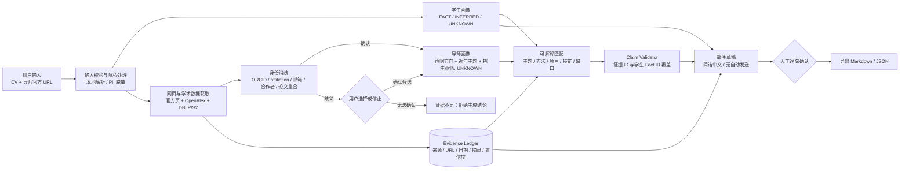

# 导师双选 AI 工具：MVP 立项与技术可行性分析

> 调研基准日：2026-09-18（Asia/Shanghai）  
> 目标：面向一名学生独立开发者，在 1–2 周内验证“证据驱动的导师理解与匹配”是否有真实价值。  
> 边界：本报告是产品与技术分析，不包含代码。API、价格、额度与竞品数据会变化，上线前应重新核实。

## 0. 执行摘要

**建议做，但必须缩小为“单导师研究与匹配助手”，而不是“全国导师推荐/自动套磁 Agent”。**

最有价值、也最难被普通邮件生成器替代的环节，不是写信，而是：

1. 确认网页和论文确实属于同一位导师；
2. 用近 3–5 年论文修正可能过时的官网描述；
3. 把导师结论、学生经历和邮件句子都绑定到可点击证据；
4. 在证据不足时明确输出 `UNKNOWN`，而不是补全一个“看起来合理”的答案。

**一句话产品定义：**

> 一个面向中国高校硕博双选的、以公开证据为基础的单导师研究与匹配助手：把导师官方页面与近年论文整理成可核验画像，指出学生的真实匹配点与缺口，并生成事实受控、需人工确认的中文联系邮件草稿。

推荐 v0.1 输入：**一份 CV + 一个导师官方主页 URL**；输出：**带来源的导师画像、可解释匹配报告、事实受控的邮件草稿**。不做全国搜索、批量导师排名和自动发送。

---

## 1. 重新定义问题

### 1.1 真正的 Job-to-be-done

用户不是单纯想“写一封好邮件”，而是想在有限时间内降低一个高风险决策的不确定性：

> “这个导师现在真正做什么、我是否真的匹配、有哪些可靠事实可以支撑我联系他？”

邮件只是研究结论的最后一种表达。如果上游身份消歧、研究方向和学生事实错了，语言再自然也只是更可信的错误。

### 1.2 用户最痛的部分

按价值和难度排序：

1. **研究导师与核实当前方向**：信息分散、过时、粒度不一，最耗时。
2. **判断匹配**：需要同时理解导师工作和学生经历，最需要解释性。
3. **写邮件**：重复，但已有大量通用工具可完成，差异化最弱。

### 1.3 MVP 应聚焦的价值点

**把“查 1 位导师需要 60–120 分钟”压缩到“10–15 分钟完成机器初稿 + 人工核验”，且所有关键结论可回到原始来源。**

### 1.4 第一版一定不要做

- 全国导师数据库、全校/全院批量爬取；
- 自动群发、自动找邮箱、自动跟进；
- 黑箱式 `87%` 匹配分；
- 多 Agent、LangGraph 编排、MCP 插件生态；
- 依赖 Google Scholar、CNKI、百度学术页面爬虫；
- 推断导师人品、指导风格、团队规模、回复率；
- 根据论文作者顺序断言导师贡献（不少学科按字母排序）；
- 把“未找到招生信息”写成“不招生”。

---

## 2. 真实用户流程分析

| 阶段 | 学生手工动作 | 典型问题 | 自动化建议 | 人工是否保留 |
|---|---|---|---|---|
| 目标定义 | 确定学校、学位、方向、地域、时间 | 兴趣描述过宽 | 表单结构化 | 是 |
| 导师发现 | 找学院师资目录、跨学院名单 | 漏掉交叉学院 | v0.2 再做搜索 | 是 |
| 身份确认 | 核对姓名、学院、主页、邮箱 | 重名、调动、兼职 | 规则化消歧 | **必须** |
| 官方信息收集 | 打开个人/实验室页面 | 页面过时、结构混乱 | 页面抽取 | 是 |
| 论文收集 | 查近 3–5 年论文 | 归错作者、重复版本 | API + DOI 去重 | 是，抽检 |
| 当前方向判断 | 对论文分主题、看时间变化 | 被单篇热点误导 | 时间加权聚类 + LLM 归纳 | **必须** |
| 团队/招生核实 | 查成员页、招生公告、个人声明 | 无日期、长期未更新 | 抽取显式陈述 | **必须** |
| 学生画像 | 从 CV 提取经历、技能、兴趣 | PDF 解析错、模型脑补 | 本地解析 + 用户确认 | **必须** |
| 匹配分析 | 逐项比较主题、方法、技能、产出 | “方向相似”被夸大 | 规则 + embedding + LLM 解释 | 是 |
| 联系决策 | 权衡契合度、招生信号、证据充分度 | 把未知当否定 | 输出分维度结论 | **必须** |
| 写信 | 选择经历、引用真实工作、压缩措辞 | 模板化、虚假“拜读” | 受控生成 | **必须** |
| 状态管理 | 保存已查/已联系/回复 | 信息散落 | v0.2 简单看板 | 是 |

结论：

- **最耗时**：官方页、论文、实验室和招生信息的收集与交叉核实。
- **最容易出错**：作者身份消歧，其次是把旧方向或单篇论文当成当前主线。
- **最适合自动化**：页面抽取、论文元数据归一化、时间排序、候选作者筛选、证据索引、初步主题聚类。
- **必须人工确认**：导师身份、论文归属的边界案例、当前方向解释、招生状态、最终邮件发送。

---

## 3. 数据来源可行性分析

### 3.1 数据源矩阵

“国内可访问性”没有稳定的官方保证，以下均应在目标校园网、家庭宽带和实际部署区做连通性测试；无法确认的地方不作承诺。

| 来源 | 公开 API / Key / 免费额度 | 可获取字段与准确性 | 作者映射能力 | ToS / robots /国内访问 | MVP 结论 |
|---|---|---|---|---|---|
| 高校/学院/实验室官网 | 无统一 API；按站点访问 | 职称、学院、邮箱、方向、招生声明；身份权威但可能过时 | **最强身份锚点** | 每域检查 `robots.txt`、条款、限速；国内通常可达但各站不稳定 | **核心**，v0.1 仅抓用户给定 URL |
| 招生公告 | 无统一 API | 明确招生项目、年份、学位；时效性高 | 与姓名/学院联合 | 同上；必须保存发布日期 | **核心补充** |
| [OpenAlex](https://help.openalex.org/api/) | 公开 API；可无 Key；免费 Key 目前为 `$1/日`，无 Key `$0.10/日`；100 req/s 硬上限 | works、authors、institutions、affiliations、topics、DOI、引用等；覆盖广，元数据质量不均 | 有 author/institution ID，但同名仍需外部锚点 | 数据 CC0；API 使用计费模型已在 2026 年更新；国内连通性**需实测** | **主学术源**。官方[价格与示例](https://help.openalex.org/access/example-costs/) |
| [Semantic Scholar](https://www.semanticscholar.org/product/api) | 多数端点可免认证；建议申请 Key；初始 Key 额度 1 RPS；匿名共享池会波动 | paper、author、abstract、citations、venue、SPECTER2 embedding、OA PDF | authorId 有用；affiliation 完整性有限，不能单独定人 | 需署名；商业用途需核对[许可](https://www.semanticscholar.org/product/api/license)；国内**需实测** | **增强源**，用于摘要/引用/候选交叉核验 |
| [DBLP](https://dblp.org/db/) | 公共搜索/API 与 XML dump；无需常规 Key | 计算机领域论文、venue、作者 profile；人工策展质量高 | CS 同名拆分较好，但仍非绝对；非 CS 弱 | 元数据 CC0；在线 API 有保护性限流，大批量应走 dump；国内**需实测** | **CS/AI 强烈推荐**，非 CS 不作主源 |
| [Crossref](https://www.crossref.org/documentation/retrieve-metadata/rest-api/access-and-authentication/) | 公共/礼貌池无需 Key；`mailto` 进入礼貌池；公开单条 5/s、礼貌池 10/s，列表请求更低；Plus 付费 | DOI、标题、作者、期刊、日期、部分摘要/affiliation | 作者身份弱，适合 DOI 校验和补元数据 | 要求缓存、User-Agent、退避；元数据大多可重用，但摘要版权另论 | **DOI 校验/补全**，不是作者发现主源 |
| [arXiv](https://github.com/arXiv/arxiv-docs/blob/develop/source/help/api/user-manual.md) | 公共 API、无需 Key；连续请求建议至少间隔 3 秒 | title、authors、abstract、categories、submitted/updated、journal ref | affiliation 通常不足，同名风险高 | 有专门 API/ToS；大批量用 OAI-PMH | **预印本补充**，不能单独定人 |
| Google Scholar | **无可依赖的公开 Scholar 检索 API** | 覆盖广、引用数常用，但更正可能延迟 | profile 有帮助但自动化不可依赖 | 官方帮助要求自动软件尊重 [robots.txt](https://scholar.google.co.uk/intl/en/scholar/help.html)；Google 反对未经许可的自动查询 | **不作核心依赖**；只提供人工打开链接 |
| CNKI | 未找到面向普通开发者的、公开免费通用检索 API | 中文论文覆盖强；题录/全文受产品和订阅限制 | 中文姓名重名严重，机构字段仍需核验 | 会员协议明确限制机器人批量下载；通用 API/商业授权需与 CNKI **进一步核实** | **v0.1 不接入、不爬取** |
| 百度学术 | 未确认公开通用“检索结果 API”；现有公开材料主要面向资源方上传 | 中文发现有价值，但结构化取数能力不明确 | 不能依赖 | 检索自动化、额度和许可均**需进一步核实** | **仅人工跳转** |
| [ORCID](https://info.orcid.org/documentation/integration-and-api-faq/) | 匿名/注册 Public API；注册客户端需 OAuth。当前文档列出匿名 25k/日、注册 100k/日 | ORCID iD、姓名、公开任职、works、外部 ID | **强标识符**，但中国导师覆盖和维护程度不一 | 免费 Public API 主要面向非商业用途；商业产品须重新审查许可/Member API | **高价值锚点**，有则强用、无则不强求 |
| [OpenCitations](https://github.com/opencitations/oc_docs/blob/main/docs/api/quickstart.md) | 无 Key 可用；频繁访问可申请免费 token；180 req/min/IP | DOI 引用关系、部分书目元数据 | 不解决作者身份 | 开放数据，适合引用补充 | 可选，不是 v0.1 必需 |
| [ROR](https://ror.readme.io/docs/rest-api) | 无需注册；约 2000 请求/5 分钟/IP | 机构规范名、别名、地点、层级、ROR ID | 用于 affiliation 归一化 | 开放 API；国内**需实测** | **推荐小型辅助源** |

### 3.2 最适合国内 MVP 的组合

**v0.1：用户提供的学校官方页 + OpenAlex +（CS/AI 时）DBLP + Semantic Scholar + Crossref/ORCID/ROR 辅助。**

原因：

- 学校官方页负责“这个人是谁、现在在哪、公开怎么描述自己”；
- OpenAlex 负责广覆盖和近年论文列表；
- DBLP 在计算机领域提供更稳定的作者 profile 与会议论文覆盖；
- Semantic Scholar 补摘要、引用和作者 ID；
- Crossref 用 DOI 进行去重与元数据核验；
- ORCID/ROR 分别增强人和机构的唯一标识。

这一组合仍不能保证 100% 正确，所以必须保留“候选作者确认”和 `UNKNOWN`。

---

## 4. 最大的数据难点

### 4.1 Author Resolution / 导师身份消歧

#### 原则

- **姓名只负责召回，绝不负责确认。**
- “论文很多、方向相似”不是可靠身份；至少需要一个强锚点或两个独立中强证据。
- 任何冲突证据必须显式保存，不能被正证据平均掉。

#### 消歧流程

1. **建立官方锚点**：从学校页抽取姓名中英文、学院、职称、邮箱域名、主页、ORCID/DBLP/Scholar 链接、官方列出的论文/合作者。
2. **召回候选**：在 OpenAlex/S2/DBLP 以中英文姓名及别名找候选 author ID。
3. **计算证据特征**：
   - 强证据：官方页直接链接 ORCID/DBLP；官方页论文 DOI 与候选作品重合；公开邮箱一致。
   - 中证据：当前/历史 affiliation 一致；稳定合作者与官方实验室成员重合；主页列出的论文题名一致。
   - 弱证据：研究主题相似、城市/国家相同、姓名拼音相同。
   - 冲突：同时期所属机构明显不同、学科完全不相干、邮箱/主页指向另一人。
4. **规则门控**：
   - `CONFIRMED`：至少一个强证据，且无重大冲突；或两个独立中证据并经用户确认。
   - `REVIEW_REQUIRED`：只有中/弱证据，展示 2–5 个候选及差异，让用户选。
   - `REJECTED`：出现明确冲突。
5. **论文级归属**：author ID 确认后仍对近年论文检查 affiliation、合作者、主页重合；边界论文标成 `UNCERTAIN`，不参与方向结论。
6. **持久化决策**：保存“为何选择/拒绝该 author ID”的证据，后续数据刷新时可复审。

不建议把一个内部加权分直接展示给用户。内部可以排序候选，UI 应展示证据组合与置信等级。

### 4.2 官网过时与当前方向

把两个概念分开：

- `declared_research_interests`：导师/学院官网明确声明的方向；
- `observed_recent_topics`：从已确认归属的近年论文观察到的主题。

建议时间权重：近 0–2 年 0.60、3 年前 0.25、4–5 年前 0.15；具体可用指数衰减，但必须保留原始年份。只有满足“至少 3 篇已确认论文、跨至少 2 个年份”时，才输出“上升/持续/减弱”趋势；否则输出“证据不足”。单篇热点论文只能说“近期出现”，不能说“已转向”。

LLM 只负责给已聚类的标题/摘要命名和解释；论文归属、年份、计数、权重由确定性代码完成。

### 4.3 团队规模与招生信息

| 信息 | 可以可靠输出 | 只能谨慎描述 | 必须 UNKNOWN |
|---|---|---|---|
| 团队成员 | 页面明确列出的姓名/身份/页面日期 | “公开成员页列出 N 人”，不等于真实规模 | 无成员页或页面明显过期 |
| 学生类型 | 明确标注 PhD/硕士/本科/博士后 | 未标注者只写“成员” | 不从姓名、论文作者顺序猜身份 |
| 招生 | 有日期、学位层次、方向、联系方式的明确声明 | 无日期声明写“曾公开表示”，并提示复核 | 未找到声明时写“未发现公开信息”，不能写“不招生” |
| 名额 | 明确数字且仍在有效期 | “有招聘信号” | 不从团队人数、经费、论文数推断 |
| 指导风格/口碑 | 导师或学校正式文件的可引用制度信息 | 用户自行询问在读生 | 不从论坛传闻生成结论 |

---

## 5. Evidence Grounding 设计

### 5.1 核心数据结构

```yaml
claim:
  id: claim_current_topic_01
  subject_id: professor_demo
  text: "近三年持续开展检索增强生成相关研究"
  claim_type: observed_research_trend
  status: SUPPORTED        # SUPPORTED | PARTIAL | CONFLICTED | UNKNOWN
  confidence: HIGH         # HIGH | MEDIUM | LOW；不是伪精确小数
  generated_by: rule_plus_llm
  evidence_ids: [ev_paper_2026_a, ev_paper_2025_b, ev_paper_2024_c]
  checked_at: 2026-09-18T10:00:00+08:00

evidence:
  id: ev_paper_2026_a
  source_type: semantic_scholar
  source_url: "https://example.org/paper"
  canonical_id: "doi:10.xxxx/example"
  title: "Paper A"
  published_date: 2026-03-01
  retrieved_at: 2026-09-18T09:30:00+08:00
  evidence_text: "仅保存支持该原子事实的短摘录或元数据"
  author_resolution_status: CONFIRMED
  source_tier: 2           # 1 官方页；2 学术 API；3 第三方
  content_hash: "sha256:..."
```

### 5.2 防幻觉机制

1. 原始来源先进入 evidence ledger，LLM 不直接“自由上网后写答案”。
2. 把页面内容拆为原子事实；每个导师事实必须带 `evidence_ids`。
3. 论文只有在作者身份 `CONFIRMED` 后才能进入“当前方向”集合。
4. LLM 使用 JSON Schema/Structured Output 返回 claims；schema 只允许引用给定 evidence ID。OpenAI Responses API 支持文件输入和结构化 JSON；但结构化输出只保证格式，不保证事实，仍要做验证。[官方 Responses 文档](https://developers.openai.com/api/reference/cli/resources/responses/methods/create)
5. 生成后运行确定性检查：引用存在、日期一致、姓名/机构无冲突、邮件中导师事实覆盖率 100%。
6. 再运行一个“证据蕴含”检查器；发现证据不足时删除或降级为 `UNKNOWN`，而不是重写得更圆滑。
7. UI 展示“结论 → 证据卡片 → 原始链接”，同时显示抓取日期和来源等级。

### 5.3 邮件中必须有证据的句子

必须绑定证据：

- “您的团队近期主要研究……”；
- 任何论文、项目、实验室、奖项、招生状态；
- “近年转向/持续/聚焦”等趋势判断；
- 学生自己的项目、论文、技能和成果（绑定 student fact ID）。

无需导师 citation 的句子：问候、联系意图、礼貌收尾、明确的个人研究兴趣。但这些句子也不能冒充已完成经历。

邮件 UI 可以不显示脚注，但系统内部必须保留句子到 evidence/fact ID 的映射，并在“审核视图”中可展开。

---

## 6. Student Profile 设计

`FACT` 只来自 CV/用户输入并经确认；`INFERRED` 仅用于检索标签和匹配解释，不可改写成个人经历；`UNKNOWN` 表示未提供。

```yaml
student_id: stu_demo
profile_version: 1
consent:
  cv_processing: true
  external_llm_processing: false
  pii_redacted: true

identity:
  name: {value: null, status: UNKNOWN, source: null}
  email: {value: null, status: UNKNOWN, source: null}

education:
  institution: {value: "某大学", status: FACT, source: cv_page_1}
  major: {value: "计算机科学", status: FACT, source: cv_page_1}
  degree: {value: "本科", status: FACT, source: cv_page_1}
  gpa: {value: null, status: UNKNOWN, source: null}
  rank: {value: null, status: UNKNOWN, source: null}

skills:
  - {name: Python, level: null, status: FACT, source: cv_page_1}
  - {name: PyTorch, level: null, status: FACT, source: cv_page_1}

research_interests:
  facts:
    - {value: "信息检索", status: FACT, source: user_confirmed}
  inferred_tags:
    - {value: "RAG", status: INFERRED, based_on: [project_01], confidence: MEDIUM}

experiences:
  projects:
    - id: project_01
      title: {value: "课程检索系统", status: FACT, source: cv_page_1}
      role: {value: "开发者", status: FACT, source: cv_page_1}
      description: {value: "实现 BM25 检索与评测", status: FACT, source: cv_page_1}
      methods: [{value: BM25, status: FACT, source: cv_page_1}]
      outcomes: []            # 没写结果就保持空，不补数字
  research: []
  internships: []
  competitions: []

publications: []
future_direction:
  value: "希望研究可靠检索增强生成"
  status: FACT
  source: user_confirmed

parse_warnings:
  - "GPA 未在 CV 中找到"
user_confirmed_at: null       # 未确认前不得进入最终邮件
```

关键约束：

- `INFERRED` 标签只能用于召回/比较，生成邮件时若要使用，必须让用户确认并升级为 `FACT`。
- 数字、奖项名、论文状态、个人角色均不得从上下文“合理推断”。
- CV 解析后先显示差异化确认页；用户确认前不生成最终邮件。

---

## 7. Professor Profile 设计

```yaml
professor_id: prof_demo
identity_resolution:
  status: CONFIRMED
  canonical_name: "示例教授"
  aliases: ["Example Professor"]
  selected_author_ids:
    openalex: "A123"
    semantic_scholar: "S456"
    dblp: null
    orcid: null
  supporting_evidence: [ev_official_profile, ev_affiliation, ev_paper_overlap]
  conflicts: []

basic:
  name: {value: "示例教授", status: FACT, evidence_ids: [ev_official_profile]}
  institution: {value: "示例大学", status: FACT, evidence_ids: [ev_official_profile]}
  department: {value: "计算机学院", status: FACT, evidence_ids: [ev_official_profile]}
  title: {value: "教授", status: FACT, evidence_ids: [ev_official_profile]}
  email: {value: null, status: UNKNOWN, evidence_ids: []}
  homepage: "https://university.example.edu/faculty/example"
  lab_homepage: null

research:
  declared_interests:
    - {topic: "信息检索", status: FACT, evidence_ids: [ev_official_profile]}
  observed_recent_topics:
    - topic: "检索增强生成"
      window: "2024-2026"
      trend: EMERGING
      confidence: MEDIUM
      evidence_ids: [ev_paper_2026_a, ev_paper_2025_b, ev_paper_2024_c]

publications:
  representative: []
  recent:
    - id: paper_01
      title: "Paper A"
      year: 2026
      doi: null
      author_resolution_status: CONFIRMED
      source_ids: [ev_paper_2026_a]

collaborators:
  - {name: "合作者甲", basis: coauthor_count, evidence_ids: [ev_paper_2026_a]}

recruiting:
  status: UNKNOWN             # CONFIRMED_OPEN | HISTORICAL_SIGNAL | UNKNOWN | CONFIRMED_CLOSED
  degree_levels: []
  statement: null
  evidence_ids: []

team:
  public_roster_count: null
  actual_team_size: UNKNOWN
  members: []

freshness:
  official_page_retrieved_at: 2026-09-18T09:00:00+08:00
  latest_confirmed_publication_date: 2026-03-01
  stale_warnings: []

sources: [ev_official_profile, ev_paper_2026_a]
overall_confidence: MEDIUM
```

---

## 8. 可解释匹配算法

### 8.1 不用单一“匹配度 87%”

一个精确百分比暗示存在可靠标注数据和校准概率，而 MVP 没有。建议把“学术匹配”和“联系机会”完全分开：

1. **研究问题匹配**：主题/问题是否一致；
2. **方法与技能匹配**：学生已掌握或有邻近经验的方法；
3. **经历证据匹配**：是否有可用于邮件的真实项目/科研事实；
4. **成长缺口**：缺少的数学、实验、领域或工程能力；
5. **方向新鲜度**：匹配的是导师当前工作，还是旧简介；
6. **招生/联系信号**：独立显示 `确认开放 / 历史信号 / 未知 / 明确关闭`；
7. **证据充分度**：高/中/低。

最终结论使用四档：

- `值得联系`：至少一个强经历匹配，当前方向有多条证据，无硬冲突；
- `需要进一步了解`：方向相关但证据少、招生未知或存在关键缺口；
- `不太匹配`：当前主线与学生目标明显不同，或只有关键词重合；
- `证据不足`：身份或论文归属未解决，系统应拒绝作判断。

### 8.2 各技术的职责

| 方法 | 负责内容 |
|---|---|
| 规则 | 学位/学院等硬条件、事实状态、日期窗口、招生状态、证据覆盖、身份门控、禁止项 |
| Embedding | 学生兴趣↔论文主题、项目描述↔论文摘要、技能/方法的语义近邻召回 |
| LLM | 把 top-k 语义候选解释为“为什么匹配/为什么不匹配”，生成可读缺口和联系建议 |
| 人工 | 确认学生事实、身份边界、是否真正理解要提及的论文、最终联系决定 |

可以维护一个**仅用于排序的内部复合值**，但 UI 展示各维度等级、证据和理由，不展示两位小数。建议学术排序主要依据主题、项目/方法、技能、近年持续性；招生信号不应偷偷抬高“学术匹配”，而应作为单独维度。

---

## 9. LLM 在系统里具体负责什么

### 不需要 LLM

- URL 规范化、域名验证、重定向检查；
- robots.txt 检查、限速、缓存、重试；
- HTML/PDF 文本提取；
- DOI/arXiv ID 解析、论文去重、日期排序；
- API 调用与数据库读写；
- 作者候选规则过滤、机构/邮箱/ORCID 精确匹配；
- 证据 ID 是否存在、邮件引用覆盖率；
- 数据删除、导出、审计日志。

### 适合 LLM

- 从非统一网页文本中提取候选字段（仍需 schema 和证据位置）；
- 给近年论文主题簇命名并总结趋势；
- 把学生经历和导师主题做语义解释；
- 生成强匹配点、弱匹配点、缺口和待核实问题；
- 在事实约束下写简洁中文邮件草稿；
- 对邮件做“是否包含未支持事实”的二次审阅。

LLM 不应拥有“选择正确作者 ID”“判定页面可抓”“决定是否发送邮件”的最终权限。

---

## 10. 是否需要 Agent / Harness

### v0.1 不需要

| 技术 | v0.1 是否需要 | 理由 |
|---|---|---|
| LangChain | 否 | 直接 SDK + Pydantic 更透明，减少调试层 |
| LangGraph | 否 | 流程固定，无复杂分支/长任务恢复 |
| 多 Agent | 否 | 增加成本和不可重复性，不能自动解决身份错误 |
| MCP | 否 | 暂无跨客户端工具生态需求 |
| 传统 RAG | 否 | 单导师只有少量页面与几十篇近年论文，直接筛选证据即可 |
| Vector DB | 否 | 内存 cosine 或 SQLite 保存 embedding 足够 |

### 最简单可靠架构

`Python pipeline + Streamlit + SQLite + HTTP client + 学术 API + 单一 LLM 适配层`。

把流程实现成可重跑的阶段：`ingest → parse → resolve → enrich → claim → match → draft → validate → export`。每一阶段读写结构化对象，失败可重试，不需要“自主 Agent”。

### 什么时候才值得升级

- 用户只给姓名/学校，需要自主搜索多个页面并处理不同站点分支；
- 单次研究跨 20+ 导师，任务需要队列、断点恢复、预算控制；
- 页面解析器、学术源和审核器需要插件式扩展；
- 有足够评测集证明 agentic 浏览比固定 pipeline 提升覆盖，且没有降低身份精度。

即便升级，也优先用“有状态工作流/任务队列”，不是先上多 Agent。

---

## 11. 技术栈建议

### 推荐组合

- **应用**：Python 3.12；v0.1 直接用 **Streamlit**。它比 React 更适合表单、证据表格、确认按钮和快速迭代。
- **后端**：v0.1 不单独拆服务；业务逻辑保持纯 Python 模块。v0.2 若需要 API/多用户，再加 **FastAPI**；不选 Flask 的理由是类型/schema 与异步 HTTP 支持不如 FastAPI 顺手。
- **数据**：SQLite；Pydantic 定义对象，SQLModel/SQLAlchemy 可选。先只建 `runs / sources / evidences / claims / profiles / matches / drafts` 七类表。
- **网络**：`httpx` + 超时、重试、指数退避、缓存、明确 User-Agent。
- **页面解析**：BeautifulSoup + trafilatura/readability；动态页仅在确有必要且条款允许时使用 Playwright，v0.1 可直接提示用户粘贴文本。
- **PDF/CV**：优先 PyMuPDF 或 pypdf 本地提取；表格/版式复杂时用 pdfplumber；扫描件再让用户明确选择 PaddleOCR。不要一开始把原始 CV 上传给 LLM。
- **LLM**：做一个 `LLMProvider` 接口，输入/输出统一 JSON Schema。OpenAI 可用 Responses + Structured Outputs；DeepSeek 官方当前提供 OpenAI 兼容接口和 JSON Schema/JSON 模式，但模型名、价格会变化，应通过配置而非写死。[DeepSeek 官方文档](https://api-docs.deepseek.com/api/create-response/)
- **Embedding**：首版可用多语种 sentence-transformers 本地模型，或远程 embedding API；只做几十段文本时无需向量数据库。
- **部署**：**本地优先**。公开云 Demo 使用匿名样例，不接收真实 CV。需要云端时再做加密、删除策略、访问控制和隐私告知。

### 隐私建议

- 默认在本地解析 CV，并在发送给 LLM 前删除姓名、电话、邮箱、住址、证件信息；
- 只发送完成任务所需的经历摘要；
- 原始文件设自动删除；提供“一键删除本次运行”；
- API Key 仅存在 `.env`/系统密钥库，绝不进前端和日志；
- OpenAI 官方说明 API 数据默认不用于训练，但不同端点有不同保留行为；例如 `/v1/responses` 的应用状态取决于 `store`，`/v1/files` 需主动删除或设置到期策略。[OpenAI 数据控制](https://developers.openai.com/api/docs/guides/your-data)
- 中国《个人信息保护法》要求目的明确、直接相关、影响最小；真实上线前应按最小必要、告知同意和删除权设计。[中国人大网法条](https://www.npc.gov.cn/npc/c2/c30834/202108/t20210820_313088.html)

---

## 12. 搜索与网页获取策略

### 12.1 姓名 + 学校的后续搜索流程（v0.2）

1. **Query**：`姓名 学校 学院 教授`、中英文别名、`site:学校官方域名`、`姓名 实验室`。
2. **Candidate URLs**：保存搜索提供方、排名、标题、摘要、查询时间；不直接相信摘要。
3. **Domain verification**：学校域名白名单、HTTPS、重定向后的最终域名、页面标题/正文是否同时出现姓名和单位。
4. **官方优先**：学校/学院教师页 > 官方实验室/个人页 > ORCID/DBLP/OpenAlex/S2 > 其他第三方。
5. **robots/ToS 检查**：搜索结果只负责发现 URL，不代表允许抓取。按 RFC 9309 检查每个域的 `robots.txt`，并遵守站点条款、限速和缓存。[RFC 9309](https://www.rfc-editor.org/rfc/rfc9309.html)
6. **Parse**：保存原 URL、最终 URL、抓取时间、HTTP 状态、内容 hash 和抽取片段。
7. **Identity gate**：进入导师画像前先完成第 4 节的消歧。

### 12.2 搜索服务选择（截至 2026-09-18）

| 方案 | 当前状态 | MVP 评价 |
|---|---|---|
| Bing Web Search API | 已于 2025-08-11 退役，不能再作为新方案。[微软公告](https://learn.microsoft.com/en-us/lifecycle/announcements/bing-search-api-retirement) | 不选 |
| Google Custom Search JSON API | 不再接受新客户，并计划 2027-01-01 停用；既有客户才可过渡。[官方文档](https://developers.google.com/custom-search/v1/overview) | 不作为新项目依赖 |
| [Tavily](https://www.tavily.com/pricing) | 目前免费 1,000 credits/月，超出按 credit 计费 | v0.2 可试，先测中国网络和中文高校召回 |
| [Brave Search API](https://brave.com/search/api/) | 当前标价约 `$5/1000` 请求，并提供每月 `$5` credits（条款可能调整） | 较透明，可作为通用搜索备选；中文召回需实测 |
| [SerpAPI](https://serpapi.com/google-scholar-api) | 提供包括 Google Scholar 的第三方 SERP 服务 | 技术方便但成本、平台条款与供应商持续性风险更高；不作为默认学术源 |
| 普通人工搜索 | 用户自行搜索后粘贴官方 URL | **v0.1 最稳、零集成成本** |

推荐：v0.1 完全不做搜索；v0.2 先抽象 `SearchProvider`，用 Tavily 或 Brave 之一进行小规模 A/B 测试，并保留人工粘贴 URL。

---

## 13. 严格的 v0.1 边界

### 必须做

1. 上传一个 PDF CV，进行本地文本提取；显示解析警告与结构化 profile 确认页。
2. 输入一个导师官方主页 URL；记录最终 URL、抓取时间和来源。
3. 抽取姓名、学校、学院、职称、邮箱、公开方向和显式招生陈述。
4. 从 OpenAlex 获取近 5 年作者候选；CS/AI 可选 DBLP，S2/Crossref 负责增强与核验。
5. 出现重名时必须让用户选 author candidate，不能自动冒进。
6. 生成带证据的导师画像和分维度匹配报告。
7. 生成中文邮件草稿；所有导师事实和学生经历都能回溯到 evidence/fact ID。
8. 允许导出 Markdown/JSON，并一键删除本次 CV 与数据。

### 明确不做

- 姓名自动搜索、学院全量发现、跨导师推荐；
- Google Scholar/CNKI/百度学术爬虫；
- 批量导入、全国数据库、后台定时爬虫；
- 登录、支付、社交、评论、导师评价；
- 自动发信、邮箱连接、自动跟进；
- 多语言邮件、复杂富文本编辑；
- LangChain/LangGraph/MCP/多 Agent/向量数据库；
- “真实团队规模”“导师是否好相处”等不可验证结论。

### v0.1 验收指标

- 在 30–50 位人工标注导师上，确认论文集合的**身份精度优先目标 ≥95%**；宁可漏，不可错。
- 导师事实 citation coverage = **100%**。
- 邮件中未支持的导师事实 = **0**；虚构学生经历 = **0**。
- 解析失败或证据不足时可正确 abstain，而不是输出完整假报告。
- 人工完成一位导师研究的中位时间从约 60–120 分钟降到 **15 分钟以内**。
- 至少 5 名真实目标用户完成体验并认为“是否值得联系”的判断更快或更有把握。

---

## 14. 分阶段 Roadmap

| 版本 | 核心问题 | 新增范围 | 仍不做 |
|---|---|---|---|
| v0.1（1–2 周） | 单导师是否值得联系 | CV + 官方 URL、身份确认、近年论文、证据画像、匹配与草稿 | 搜索、批量、发送 |
| v0.2 | 如何比较少量候选 | 姓名+学校搜索、3–5 位并列比较、状态/备注、搜索 provider 抽象 | 全国库、自动群发 |
| v0.3 | 如何稳定、可扩展 | 站点适配器、缓存/队列、评测集、事实审核、可选云同步与隐私控制 | 黑箱推荐、无限爬取 |
| v1.0 | 如何规模化可信推荐 | 经过评测的导师发现、用户纠错反馈、可插拔数据源、团队运营后台、合规与滥用控制 | 默认自动发送；未经证据的声誉评分 |

每个阶段的升级条件不是“功能做完”，而是前一阶段的身份精度、证据覆盖和用户节时指标通过。

---

## 15. 失败场景、风险与 fallback

| 风险 | Fallback / 产品行为 |
|---|---|
| 导师主页无法访问 | 允许用户粘贴文本/PDF；保留原 URL；标记 `FETCH_FAILED` |
| 网页格式混乱/动态渲染 | 先正文提取，再让用户圈选/粘贴；v0.1 不强上浏览器自动化 |
| robots.txt 禁止 | 不抓；提示用户人工提供内容。robots 不是授权机制，但产品仍应尊重它 |
| 姓名重名 | 候选列表 + affiliation/ORCID/合作者/论文重合；无强证据则停止 |
| 找错论文 | 论文级 provenance；冲突论文不参与总结；允许用户排除并重算 |
| 论文信息过少 | 只输出官网声明和 `证据不足`；不做趋势判断 |
| 官网多年未更新 | 显示页面抓取日与页面可见日期；把 declared 与 observed 分列 |
| 无招生信息 | 输出“未发现公开招生信息”，建议用户在邮件中礼貌询问 |
| 团队人数不公开 | 只报“公开页面列出 N 位成员”，真实规模为 `UNKNOWN` |
| CV PDF 解析失败 | 显示原始文本、允许手工编辑；扫描件需用户同意 OCR |
| LLM 幻觉 | schema、evidence ID 白名单、claim validator、失败即删句/降级 |
| 虚构学生经历 | 仅 `FACT + user_confirmed` 可进信；每句绑定 fact ID |
| 邮件模板化/过度恭维 | 100–180 中文字左右；禁用“拜读/久仰/十分震撼”等未经用户确认措辞；给用户改写而非自动发送 |
| 垃圾邮件滥用 | v0.1 不发送；后续限速、逐封确认、禁止批量和自动跟进、审计日志 |
| 简历隐私泄露 | 本地解析、PII 脱敏、最小化发送、自动删除、一键清除、匿名 Demo |
| API Key 泄露 | 服务端环境变量/密钥库、日志脱敏、配额限制、轮换机制 |
| 学校站点 ToS 风险 | 每域条款审查、User-Agent、低频缓存、只取公开页面；禁止登录绕过/CAPTCHA 绕过 |
| 学术平台 ToS 风险 | 优先官方 API；GS/CNKI/百度学术不做爬虫；第三方代理需法务与供应商审查 |
| 国内网络不可达 | provider adapter + 超时 + 降级；至少保证“官方页 + 用户粘贴 + 本地分析”可工作 |
| API 限流/宕机 | 缓存、指数退避、任务重试、来源降级、明确缺失字段 |
| 内容版权 | 只存短证据片段和元数据，不镜像受版权保护全文；链接回原站 |
| 邮件反垃圾限制 | v0.1 无发送；未来逐封用户确认，并遵守邮箱服务商额度和收件人反骚扰要求 |

---

## 16. 是否值得开源

### 判断

值得。它有明确用户、可用一位导师完成端到端 Demo、数据源适配器可扩展，也包含有技术含量的身份消歧、证据账本和事实约束生成。它的开源价值不应是“又一个套磁 prompt”，而应是一个可审计的学术画像 pipeline。

### 真正有意义的 5 个差异化方向

1. **Evidence ledger 是一等公民**：结论、匹配点和邮件句子都可追溯，不是回答末尾堆几个链接。
2. **中国姓名与机构场景的 Author Resolution**：中英文名、拼音变体、跨学院、调动、同名候选与人工确认。
3. **时间敏感的研究轨迹**：官网声明与近年论文分开，明确“持续/出现/减弱/证据不足”。
4. **Fact-locked drafting**：导师事实绑定 evidence ID，学生事实绑定 confirmed fact ID；任何未绑定句子自动拦截。
5. **本地优先和可插拔数据源**：学校站点适配器、学术 API 适配器、LLM provider 可替换，真实 CV 默认不上传。

开源仓库应附匿名 fixtures、已标注的消歧测试集、错误案例和评测脚本。真正的护城河是“如何证明没归错人、没编事实”，不是前端或提示词。

---

## 17. 竞品与开源项目调研

GitHub Star 和最近 push 时间通过 GitHub 官方元数据于 2026-09-18 核实；Star 会持续变化。商业产品未公开技术/数据源的地方标为“未披露”，不做推测。

| 项目/产品 | Star / 最近更新 | 主要功能、技术与数据源 | 优点 | 缺点 / 与本项目重叠 |
|---|---|---|---|---|
| [ProfFound](https://github.com/gong-rh/ProfFound) | 2★；push 2026-06-30 | Python；Web 搜索 + OpenAlex + LLM；学校×方向发现、同名过滤、报告与来源链接 | 中国导师场景最接近；有低可信分区、离线测试 | 仍展示精确百分比；OpenAlex 文档描述沿用旧“mailto/无 key”说法，需跟随 2026 新计费；重叠**很高** |
| [phdtaketaketake](https://github.com/powerofjinbo/phdtaketaketake) | 33★；push 2026-07-04 | 浏览器/Pyodide、Agent skill；CV 导入、网络/论文/背景评分、证据优先 | connection-first、客户端隐私、规则透明 | 评分体系对不同学科可迁移性待验证；国内院校源不是核心；重叠**高** |
| [grad-agent](https://github.com/i-ninte/grad-agent) | 4★；push 2026-09-16 | Python/MCP/CLI；arXiv 发现、S2 authorId、网页招生信号、TF-IDF、LLM 验证、邮件/申请追踪 | 明确拒绝模糊身份，二次事实校验，流程完整 | 自动化面很宽、配置和邮箱能力超出 MVP；主要面向海外项目；重叠**高** |
| [ProfScout](https://github.com/satyam-thakur/profscout) | 0★；push 2026-07-19 | 客户端 JS；CSRankings + OpenAlex；发现、匹配、奖学金/生活成本、Gmail、Kanban | 隐私友好、覆盖和工作流完整 | 数据许可含非商业限制；中国场景与证据粒度较弱；批量发送倾向与本项目原则不同；重叠**高** |
| [cold-mail-generator](https://github.com/arponkapuria/cold-mail-generator) | 1★；push 2026-06-09 | Python、LangChain、FAISS、BeautifulSoup、Groq/Jina/Cohere；RAG 邮件生成 | 易 Demo，展示典型 RAG 方案 | 过度依赖框架/向量库，作者消歧和 claim-level evidence 不突出；重叠**中** |
| [Postgrad Contact Manager](https://github.com/wzyn20051216/postgrad-contact-manager) | 5★；push 2026-03-23 | Vue/Express/Prisma/SQLite；导师联系、材料、院校、看板 | 中国保研/考研流程和自托管定位清晰 | 更像 CRM/工作台，不负责学术画像与证据匹配；重叠**中**，可作为后续状态管理参考 |
| [baoyan_workbench](https://github.com/BlairCode/baoyan_workbench) | 52★；push 2026-08-30 | Python 标准库 + SQLite + 原生前端；本地材料、导师、待办、面试 | 本地优先、低依赖、隐私友好 | 无自动导师研究/学术 API；重叠**中低**，说明“本地工作台”有需求 |
| [camp-tracker](https://github.com/Haoyu-Gu/camp-tracker) | 6★；push 2026-02-25 | Flask dashboard + crawler；夏令营、导师邮件文件和申请状态 | 中国保研时间线/院校追踪具体 | 学校列表和爬虫适配维护成本高；不做证据匹配；重叠**低** |
| [phd-match.com](https://phd-match.com/) | 闭源；页面数据更新 2026-09-18 | CV/SOP + 选校 → AI 导师匹配；官方称覆盖多国高校、公开招聘信号；技术细节未披露 | 直接验证了“上传材料→导师匹配”的需求；覆盖中国高校 | 证据、作者消歧和评分方法不透明；云端 CV 数据与跨境隐私需用户判断；重叠**高** |
| [Research Match](https://www.researchmatch.site/) | 闭源；公开更新时间未披露，2026-09-18 检查可用 | 按兴趣/学校找教授、近年研究摘要、邮件检查；官网称基于 250M+ academic works，具体源未披露 | 明确反对代写 AI 邮件，强调用户理解和邮件审阅 | 数据源/身份消歧未披露；更偏科研实习和英文外联；重叠**高** |
| [ApexApply](https://www.apexapply.com/product/ai-matching-engine) | 闭源；2026-09-18 检查可用 | 教授匹配、近期证据、招生信号；算法和源未披露 | 明确反对“91%”伪精确分，并把 recruiting 与 fit 分开 | 样例为虚构人物，难审计实际覆盖与质量；中国适配不明；重叠**高** |
| [PhdFit](https://getphdfit.com/) | 闭源；2026-09-18 检查可用 | CV 分析、教授研究、5 维加权匹配、外联与面试准备；数据源/技术未披露 | 产品化链路完整，fit/opportunity/confidence 分列 | 价格较高；证据与身份细节未公开；主要为海外 PhD；重叠**高** |

### 市场结论

已经被较好解决的：

- 通用教授搜索和关键词/语义召回；
- CV 到研究兴趣的抽取；
- 模板化冷邮件生成；
- 申请状态/材料管理；
- 用 OpenAlex/S2 形成初步教授列表。

尚未普遍解决好的：

- 中国高校页面的异构结构、跨学院和中文同名消歧；
- “官网声明 vs 当前论文”分层与时间趋势；
- claim-level evidence，而非只给若干来源链接；
- 学生事实和导师事实双向锁定的邮件生成；
- 证据不足时可靠拒答；
- 本地隐私、国内网络与合规条件下的一人可维护实现。

**最佳切入空白：不是做更大的导师库，而是做“可信研究报告生成器”——单导师输入、身份消歧、时间敏感画像、双向事实锁定、证据审计。**

---

## 18. 最终结论

### A. 是否值得做 MVP？

**值得。**需求真实、Demo 明确、两周可验证，且“证据驱动 + 中国导师场景”有可区分空间。但不应把商业成功建立在自动群发或大规模爬虫上。

### B. 最大的 3 个技术风险

1. 作者同名与论文误归因；
2. 高校网页异构、过时、无法访问；
3. LLM 把弱证据扩写成确定结论，尤其污染邮件。

### C. 最大的 3 个产品风险

1. 用户只把它当免费邮件生成器，不愿为研究报告付出确认步骤；
2. “研究匹配”不等于招生机会，用户可能错误理解结果；
3. 真实效果难以衡量：回复率受学校、时机、名额和学生背景影响，不能归因给工具。

### D. 最容易做错的地方

**为了让结果看起来完整，悄悄把 UNKNOWN 变成推断，把推断变成事实。**其次是展示一个缺乏校准意义的精确总分。

### E. 最推荐的 MVP 形态

本地 Streamlit 单页应用：左侧 CV 与导师 URL；中间是学生事实确认、作者候选确认；右侧输出证据化导师画像、匹配矩阵、缺口、待询问问题和中文邮件草稿。每个结论可展开来源；没有“发送”按钮。

### F. 第一周只做 5 件事

1. 定义并冻结 `StudentProfile / ProfessorProfile / Evidence / Claim` 四个 schema 与 `FACT/INFERRED/UNKNOWN` 规则。
2. 手工建立 15–20 位中国高校导师的金标准样本：官方页、正确 author ID、近年论文、已知歧义。
3. 跑通“官方 URL → 页面证据 → OpenAlex 候选 → 人工确认 → 近 5 年论文”的非 LLM pipeline。
4. 做 claim/evidence 浏览界面和 100% citation coverage 检查；证据不足必须能停止。
5. 接入一个 LLM，仅用于主题归纳、匹配解释和邮件草稿；用金标准测试“错人、编经历、无证据句子”三个红线。

---

## 19. 建议架构流程图



---

## 20. 关键官方资料索引

- [OpenAlex API 与当前计费](https://help.openalex.org/access/pricing/)
- [Semantic Scholar Academic Graph API](https://www.semanticscholar.org/product/api)
- [Crossref REST API 访问与限额](https://www.crossref.org/documentation/retrieve-metadata/rest-api/access-and-authentication/)
- [arXiv API User Manual](https://github.com/arXiv/arxiv-docs/blob/develop/source/help/api/user-manual.md)
- [ORCID Public API 限额与条款](https://info.orcid.org/ufaqs/what-are-the-api-limits/)
- [DBLP 数据与 CC0 说明](https://dblp.org/db/)
- [Google Scholar 自动访问提示](https://scholar.google.co.uk/intl/en/scholar/help.html)
- [OpenAI API 数据控制](https://developers.openai.com/api/docs/guides/your-data)
- [Robots Exclusion Protocol RFC 9309](https://www.rfc-editor.org/rfc/rfc9309.html)
- [中华人民共和国个人信息保护法](https://www.npc.gov.cn/npc/c2/c30834/202108/t20210820_313088.html)

